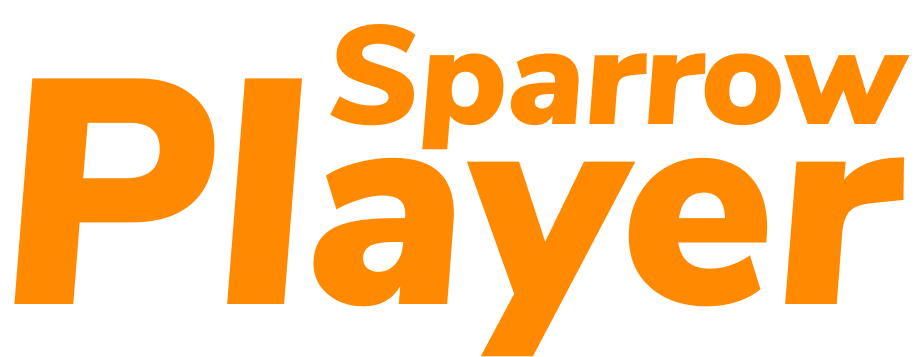

# Sparrow Player 
 

Sparrow Player es una Red Social sobre Juegos de mesa, donde podras compartir tus opiniones con otros jugadores y enterarte de próximos eventos. Además los otros participantes podran dar puntuacion de tus publicaciones y para así ser el jugador con más experiencia . 

  
# DEFINICION DEL PRODUCTO 🔎
 Esta aplicación esta enfocada en afisionados de los juegos de mesa.
Los participantes deberán registrarse para crear su propio perfil, de esta manera podran realizar sus publicaciones sobre sus experiencias con algun juego en particular.

Nuestro objetivo es que los participantes de DovePlayer puedan interactuar entre ellos y además aplicando la jugabilidad, ya que ademas cada usuario podrá ser calificado por su publicacion .

OBJETIVOS DEL USUARIO 💻 
- Ver experiencia de otros usuarios
- Saber en que consiste un juego antes de comprar.
- Saber sobre próximos eventos 

Este proyecto se desarrollo basado en historias de usuario, las cuales fueron planificadas en la herramienta TRELLO y pueden observar entrando al siguiente link:

[Planificación Trello](https://trello.com/b/6t8b40Fi/dove-player)

# Desarrollo del Producto 🚀

Para diseñar nuestro producto iniciamos realizando un sketch a mano alzada, en donde plasmamos las posibles vistas que queriamos que tuviera nuestra aplicación, la cual pueden encontrar en la sección de imagenes de la planificación de trello.

Después comenzamos con la maquetación digital de nuestro producto para la cual utilizamos la herramienta Figma, el cual pueden revisar consultando el siguiente link:

[Figma Sparrow PLayer](https://www.figma.com/proto/N6tQyt7i4cmFYI9R6ZVrJR/DovePlayer?node-id=1%3A2&scaling=scale-down)
